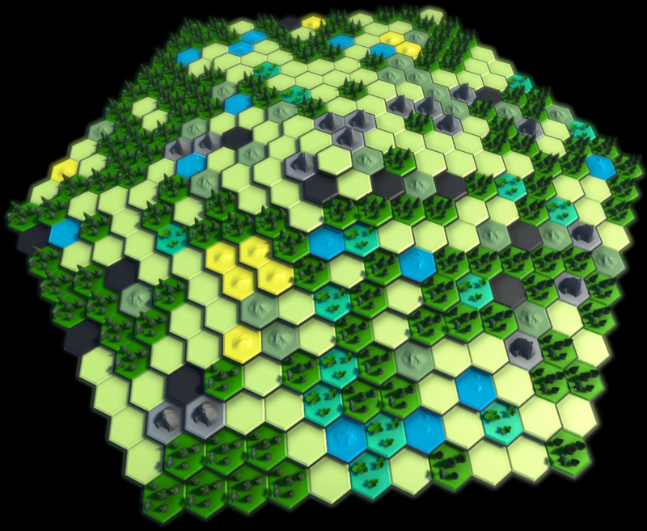
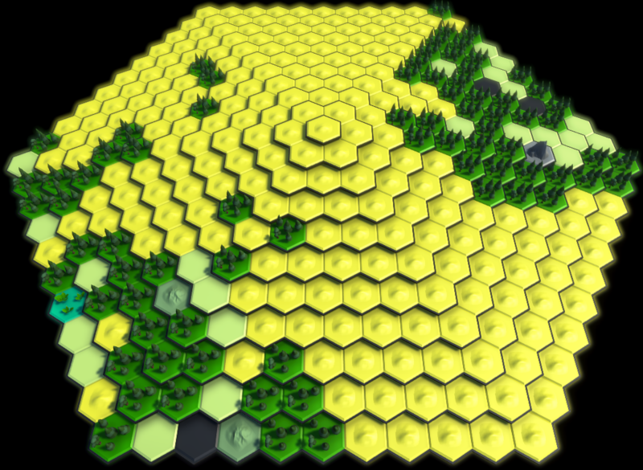
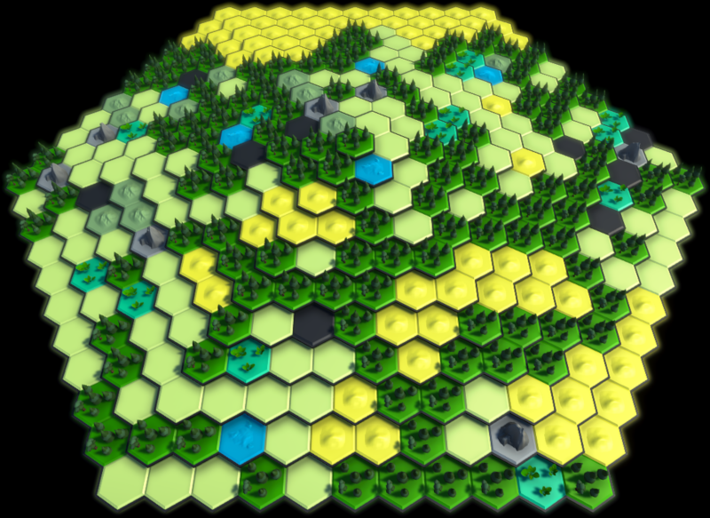

# Terrain generation with neighbour support

This is the method I use to generate tile-based terrains in the strategy game I'm developing. It's based on a simple idea, but gives quite fine-grained control while allowing terrains to be randomly generated in a natural way.

The code here is just a few files that have been taken from my game and stripped down to the barebones. As a result, things may have ended up being organised in a slightly unexpected way, but it made more sense in the context of my entire project!

## Typical methods of terrain generation
Terrain generation is very common in video games. A popular example is the Civilization series, where game maps consist of hexagonal tiles. Each tile has a base terrain such as plains, grassland, desert, tundra, snow, etc.

The most common technique for terrain generation is probably Perlin noise and heightmapping. For my purposes, I wanted a bit more control over factors like which terrain types appear next to each other. Generating maps using cellular automata is also common, and my method is somewhat closer to this. As mentioned, the idea is quite simple, so I'd be very surprised if something similar doesn't already exist. (I haven't personally seen it elsewhere, but I've not searched particularly hard).

The game I'm developing uses eight terrain types: Mountain, Lake, Desert, Swamp, Plains, Woods, Hills and Cave. The map consists of hex tiles arranged in concentric rings about a central tile, but the algorithm I use can easily be adapted to any graph based map and any set of terrain types.

 I wanted to be able to have the game generate the terrain randomly while incorporating constraints such as the following:

* Woods should be common and should appear in loose clumps.
* Hills and Mountains should tend to clump together, but with a greater proportion of Hills within the clumps.
* Caves should be likely to appear around Hills and Mountains, but should rarely appear next to each other.
* Deserts should discourage the presence of adjacent Lakes, and Lakes should discourage adjacent Deserts more strongly.

In the picture above you can see these constraints seem to have been adhered to.

(Caves are solid black, Plains light green, Hills greyish green with a bumpy texture, Deserts yellow, Swamps teal.)

## How the algorithm works
The idea is that each landscape type has a degree of support for all the other landscape types. This data is stored in an integer support matrix. (Ideally read from a file, but in **LandscapeData.cs** I've just hardcoded it in for convenience.)

1. First the terrain is seeded by randomly choosing initial landscape types for each hex tile.

 Our LandscapeData class has a field for the base probability of each landscape, so we can bias the initial seeding process if desired.

2. We then iterate through the tiles on the board. For each tile, a landscape type is proposed at random.

3. We calculate the sum total of support for the proposed landscape from its neighbouring tiles.

 The landscape then has a chance of being accepted or rejected: the higher its support, the more likely it is to be accepted.

4. If the landscape is accepted, we move on to the next tile. Otherwise, we make another proposal for the same tile and repeat step 3.

The most important methods are *CalculateSupportFromNeighbours*, *PickLandscapeUsingNeighbours* and *SmoothTerrainUsingInfluence* in **TerrainModel.cs**.

If needed, steps 2-4 can be repeated to further "smooth out" the initial state of the board. Usually this is only needed a couple of times, though the smoothing process can itself be interesting (see below).

The main strength of the algorithm is how easy it makes it to fine tune the behaviour of the terrain. For example, the constraints listed earlier were quite specific, but all we have to do to achieve them is edit a few values in the support matrix:

* We make most landscape types support Woods so that they're generally likely to be accepted. We give Woods strong support for themselves so they clump together.
* We give Mountains and Hills strong support for each other (but Mountains support Hills more than the other way round).
* We give Caves strong negative support for themselves so they're unlikely to be accepted when proposed next to each other.
* We give Deserts and Lakes negative support for each other, with Lakes' negative support for Deserts being greater.

## Simulating a competitive ecosystem
It can be interesting to watch the landscape evolve over smoothing iterations using *SmoothTerrainUsingInfluence*. Like an ecosystem, niches of cohabiting landscape types go through cycles of growth and decline in a feedback loop with their surrounding environments.

One scenario that demonstrates this nicely is when we edit the support matrix in **LandscapeData.cs** so that Deserts are inclined to "kill off" other landscapes. We set the support of Deserts for themselves to 14.5, but for all other types excluding Woods to -10. We then give Deserts a tiny amount of support for Woods (say 0.1).

What happens is a constantly evolving back and forth struggle between Deserts and everything else. Over dozens of smoothing iterations, Deserts can become dominant and well-established as in the picture below.

Once this happens, they can remain dominant for quite a while. They will never permanently take over however, since there is always some amount of support for Woods. Eventually, the tables will turn as Woods (and the other landscapes they support) re-establish a foothold and fight back the Deserts. The picture below shows what has happened a few hundred iterations after the previous one.

## Final notes

One thing to keep in mind when calling *SmoothTerrainUsingInfluence* is whether it's better to change the terrain in place as it is iterated over, or to make a new copy and fill it in based on the original. I decided to change the terrain in place, since otherwise the new terrain may fail to respect rules like having certain landscape types not appear next to each other. (They won't be able to tell they're adjacent in the new copy.)

Another issue is the order of iteration. It's not apparent in the pictures above, but on bigger maps there is a bias towards clumps generally being vertical, due to the order in which the tiles are iterated. This could be avoided by iterating in a random order, but for my game I'm happy with how things look as they are.
